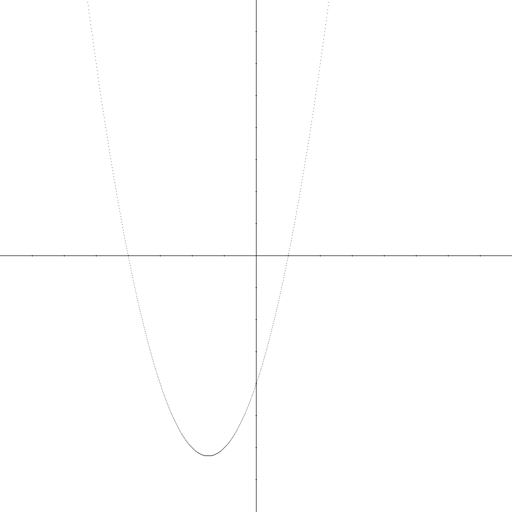

# ARKO PROJECTS

### 📚 Table of Contents

### RISC-V
- [RISC-V - Quadratic Function Plotter](#risc-v---quadratic-function-plotter)
  - [🧾 Configuration](#🧾-configuration)
    - [🧮 Quadratic Coefficients (Lines 40–43)](#🧮-quadratic-coefficients-lines-40–43)
    - [🖼️ Bitmap Files (Lines 53–54)](#🖼️-bitmap-files-lines-53–54)
  - [▶️ How to Run](#▶️-how-to-run)
  - [🗂️ Resources](#🗂️-resources)

### Intel x86
- [Intel x86 - Julia Fractal](#intel-x86---julia-fractal)
  - [Build and run guide](#build-and-run-guide)
    - [🧰 Requirements](#🧰-requirements)
    - [📁 Project structure](#📁-project-structure)
    - [⚙️ Building the project](#⚙️-building-the-project)
    - [🚀 Using the program](#🚀-using-the-program)
      - [🕹️ Controls](#🕹️-controls)

# RISC-V - Quadratic Function Plotter

A RISC-V assembly program that plots a quadratic function of the form:

```
Y = A * x^2 + B * x + C
```

The function is drawn onto a **1-bit depth bitmap** (black and white). The program clears the input image to white, draws the X and Y axes, and overlays the quadratic curve in black.



---

### 🧾 Configuration

Parameters can be set in the `quadratic_function.asm` file:

#### 🧮 Quadratic Coefficients (Lines 40–43)
- `scale` – scale of the graph
- `constA` – coefficient A
- `constB` – coefficient B
- `constC` – coefficient C

#### 🖼️ Bitmap Files (Lines 53–54)
- `ifname` – input bitmap file name
- `ofname` – output bitmap file name

You can use any input bitmap. The program will overwrite the background to white before drawing.

---

### ▶️ How to Run

1. Launch the `rars_3897cfa` simulator.
2. In the top menu, go to: `File` → `Open` → select `quadratic_function.asm`
3. Click `Run` → `Assemble` and press **F5**.
4. The output will be generated as `result.bmp` in the same directory.

---

### 🗂️ Resources

Several sample **input bitmaps** are included and can be used as backgrounds for plotting the function.


# Intel x86 - Julia Fractal

Fractal Julia is a graphical program that visualizes Julia sets - mathematical fractals created by iterating complex numbers. The rendering is done using a combination of C and low-level assembly (NASM), and displayed through the SDL2 library. The program allows real-time interaction with parameters such as zoom, position, and complex constant values.


## Build and run guide

### 🧰 Requirements

Make sure you have the following installed:

- **CMake** (version 3.29 or newer) – [Download CMake](https://cmake.org/download/)
- **NASM** (Netwide Assembler) – [Download NASM](https://www.nasm.us/pub/nasm/releasebuilds/)
- **C compiler**, e.g.:
  - GCC (MinGW for Windows) – [Download MinGW](https://winlibs.com/)
  - MSVC (Microsoft Visual Studio) – [Download Visual Studio](https://visualstudio.microsoft.com/)

Make sure all these tools are added to your system's PATH.

---

### 📁 Project structure
Your project folder should look like this:

```
Fractal_Julia/
├── CMakeLists.txt
├── main.c
├── Julia.h
└── Julia.asm
```

---

### ⚙️ Building the project

Run the following commands from the root project directory:

```bash
# Create a build directory
mkdir build
cd build

# Build the project
cmake --build . --config Debug
```

After building, the executable will be placed in:
```
Fractal_Julia/executables/
```

---

### 🚀 Using the program

Navigate to the output folder and run the executable:

- **Windows**:
```bash
cd ../executables
./Fractal_Julia.exe
```

- **Linux/macOS**:
```bash
cd ../executables
./Fractal_Julia
```

### 🕹️ Controls

- Press **C** to toggle colored mode
- Use **arrow keys** to modify the fractal's shape (change the complex C value)
- Use **mouse wheel** to zoom in and out
- Press number keys **0–9** to generate predefined fractals with simple C values
- Press and hold the **left mouse button** to drag and move around the fractal
- Press **Escape** to quit the program

